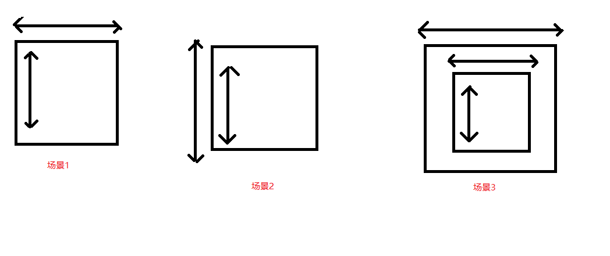
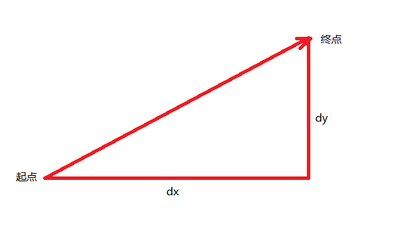
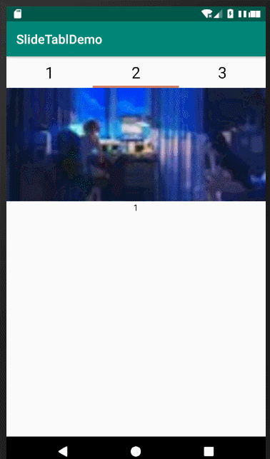

# View滑动冲突全面解析-夯实基础

滑动冲突这件事我们日常开发中应该是经常见，在我刚学习Android的时候，viewPager 与 SlidingMenu 侧滑栏的冲突也是搞得我一头雾水，不知道该怎么去解决，所以经常会去采用问百度的做法，这样下来的结果就是没有自己的思想了。网上的解决方案也都千篇一律，因为大家都很聪明啊。

***这一次，我们就辛苦一点，结合前面的学习，对Android View有一个全面的认识，学习本篇之前，请具备一定的 事件分发基础，要不然会挺吃力，可以看我以前的博客 —— [Android事件分发全面解析(基础篇)](https://blog.csdn.net/petterp/article/details/94463191)。***

好了，废话不多说了，我们开始吧！


## 常见的滑动冲突场景

常见的滑动冲突可以简单分为如下三种：

- 场景1——外部滑动方向和内部滑动方向不一致
- 场景2——外部滑动方向和内部滑动方向不一致
- 常见3——上面两种情况的嵌套。



特别是场景2和场景3，我们很多人可能都会遇到，第一种呢因为方向的不一致，所以很少有冲突的时候，而后两种就没那么简单了，特别是第三种。


## 滑动冲突的处理规则

一般来说，不管滑动冲突多么复杂，他都有既定的规则，根据这些规则我们就可以选择合适的方法去处理。

如图，对于场景1，它的处理规则是：当用户左右滑动时，需要让外部的View 拦截点击事件，当用户上下滑动时，需要让内部View 拦截点击事件。这个时候我们就可以根据它们的特征来解决滑动冲突，具体来说：根据滑动时水平滑动还时竖直滑动来判断到底谁来拦截事件。



如图所示，根据滑动过程中两个点之间的坐标就可以得出到底是水平滑动还时竖直滑动。如何根据坐标来得到滑动的方向呢？这个很简单。有很多方向可以参考，比如可以依据滑动路径和水平方向所形成的夹角，也可以依据水平方向和竖直方向上的距离来判断，某些特殊时候还可以依据水平和竖直方向的速度差来做判断，当然这个就是后话了。这里我们可以通过水平和竖直方向的距离差来判断，比如竖直方向滑动的距离大就判断为竖直滑动，否则判断为水平滑动。根据这个规则就可以进行下一步的解决办法制定了。

对于场景2来说，无法根据滑动的角度，距离差以及速度差来做判断，但是这个时候一般都能在业务上找到突破点，比如说，在某些状态下，外部View响应用户滑动，而处于另一种滑动时则需要内部View来响应View的滑动。根据这种业务需求我们也能得到相应的处理规则，有了这些处理规则就可以进行下一步处理。

对于场景3来说，它的滑动就更麻烦了一点，和场景2一样，它也无法直接根据滑动的角度，距离差以及速度查来做判断，同样还是只能从业务上找到突破点。就比如 **网易云音乐，云闪付等软件** 的滑动冲突处理。


## 滑动冲突的解决方式

首先我们先分析第一种滑动冲突场景，这也是最简单，最典型的一种滑动冲突，你可能要说，这有啥冲突的啊，ViewPager和上下滑动本来就不冲突啊，这是因为ViewPager已经帮你处理好了，但是如果这里没有采用 ViewPager 呢。这个时候就需要用到我们前面学习的 事件分发 机制了。针对滑动冲突，这里给出两种解决方式：外部拦截法和内部拦法。

### 方法1：外部拦截法:

所谓外部拦截法就是指 点击事件 都先经过父容器的拦截处理，如果父容器需要此事件就拦截，如果不需要此事件就不拦截，这样就可以解决滑动冲突的问题，这种问题比较适合点击事件的分发机制。外部拦截法需要重写父容器的 onInterceptTouchEvent 方法，在内部作相应的拦截即可。伪代码如下：

```java
//此方法一般用于事件拦截
public boolean onInterceptTouchEvent(MotionEvent ev) {
    boolean interceoted = false;
    int x = (int) ev.getX();
    int y = (int) ev.getY();
    switch (ev.getAction()) {
        case MotionEvent.ACTION_DOWN:
            interceoted = false;
            break;
        case MotionEvent.ACTION_MOVE:
            if (满足父容器拦截要求){
                interceoted=true;
            }else{
                interceoted=false;
            }
            break;
        case MotionEvent.ACTION_UP:
            interceoted=false;
            break;
    }
    mLastXIntercept = x;
    mLastYIntercept = y;
    return interceoted;
}
```

上面伪代码表示外部拦截器的处理思路：

注意一下几点：

- 根据业务逻辑需要，在ACTION_MOVE方法中进行判断，如果需要父View处理则返回 true,否则返回 false,事件分发给子View去处理。
- ACTION_DOWN一定返回false，否则根据事件分发特性，后续的滑动事件将不再会向下传递。
- 原则上ACTION_UP也需要返回false,如果返回true,并且滑动事件交给子View处理，那么子View将收不到 ACTION_UP事件，子View的 onClick事件也将无法触发。而父View不一样，如果父View在 ACTION_MOVE中开始拦截，除了一个ACTION_CANCEL传递给子View，那么后续的所有都将默认交给父View处理，所以ACTION_UP父View还是可以收到。


### 方法2：内部拦截法

也就是父容器不拦截任何事件，所有的事件都传递给子元素，如果子元素需要此事件接直接消耗掉，否则就交由父容器进行处理。这种方法和Android中的事件分发机制并不一致。需要配合 requestDisallowInterceptTouchEvent 方法才能正常工作，使用起来较外部拦截费稍显复杂。它的伪代码如下，我们需要重写 子元素 的 dispatchTouchEvent(事件分发) 方法：

```java
public boolean dispatchTouchEvent(MotionEvent ev) {
    int x = (int) ev.getX();
    int y = (int) ev.getY();

    switch (ev.getAction()) {
        case MotionEvent.ACTION_DOWN:
            //禁用父布局拦截事件，从而失去后续Action(即失去)
            getParent().requestDisallowInterceptTouchEvent(true);
            break;
        case MotionEvent.ACTION_MOVE:
            int deltaX=x-mLastX;
            int deltaY=y-mLastY;
            if (父容器需要此类点击事件){
                getParent().requestDisallowInterceptTouchEvent(false);
            }
            break;
        case MotionEvent.ACTION_UP:
            break;
    }
    mLastX=x;
    mLastY=y;
    return super.dispatchTouchEvent(ev);
}
```

父View需要重写 onInterceptTouchEvent（事件拦截）方法：

```java
public boolean onInterceptTouchEvent(MotionEvent ev) {
    int action=event.getAction();
    if (action==MotionEvent.ACTION_DOWN){
        return false;
    }else{
        return true;
    }
}
```

**注意：**

> - 使用内部拦截法要求父View 不能拦截ACTION_DOWN事件，否则后续的事件列都不会传递给子View.
> - 滑动策略的逻辑放在子View 的 dispatchTouchEvent 方法的 ACTION_EVENT 中，如果父容器需要获取点击事件则调用 getParent.requestDisallowInterceptTouchEvent(false) 方法,让父容器去拦截事件。


下面我用一个例子来实现一下：

首先我们要做的效果是什么呢？仿云闪付中间的这个Banner来做一个类似的。我们采用ViewPager+ViewPager嵌套来做。当然理想状态是 RecyclearView+ViewPager更好。


**自己的效果：ViewPager默认直接嵌套的效果。**


看起来没什么问题：

但是当我们滑动图片轮播图时，当处于最后一个图片时，再滑直接就导致我们整个页面被滑动，所以，这样的效果有时候并非是我们想要的。

不过，我们这次仿照 云闪付 这款软件。


### 外部拦截法实例：

继承**ViewPager**,重写最外层的 **onInterceptTouchEvent**()  方法：

关键代码如下：

```java
package com.petterp.slidetabldemo.vp;

import android.content.Context;
import android.support.annotation.NonNull;
import android.support.annotation.Nullable;
import android.support.v4.view.ViewPager;
import android.util.AttributeSet;
import android.view.MotionEvent;


/**
 * @author Petterp on 2019/7/3
 * Summary:
 * 邮箱：1509492795@qq.com
 */
public class CustomViewPager extends ViewPager {

    //x轴起始点
    private int mLastXIntercept;
    //y轴起始点
    private int mLastYIntercept;
    //view的宽
    private int mWidth;
    public CustomViewPager(@NonNull Context context) {
        super(context);
    }

    public CustomViewPager(@NonNull Context context, @Nullable AttributeSet attrs) {
        super(context, attrs);
    }

    @Override
    protected void onSizeChanged(int w, int h, int oldw, int oldh) {
        super.onSizeChanged(w, h, oldw, oldh);
        mWidth=w;
    }


    /**
     * 
     * 注意:一旦 onInterceptTouchEvent拦截事件，即返回true,该事件列后续事件将不再会判断是否拦截
     * @param ev
     * @return
     */
    @Override
    public boolean onInterceptTouchEvent(MotionEvent ev) {
        boolean interceoted = false;
        int x = (int) ev.getX();
        int y = (int) ev.getY();
        switch (ev.getAction()) {
            case MotionEvent.ACTION_DOWN:
                interceoted = false;
                //初始化ViewPager成员变量 mActivePointerId
                super.onInterceptTouchEvent(ev);
                break;
            case MotionEvent.ACTION_MOVE:
                int a1 = x - mLastXIntercept;
                int a2 = y - mLastYIntercept;
                //这里的逻辑为左50，右50，down位置符合要求并且为水平滑动，则拦截事件
                //当然这里还可以加别的条件，根据需求定制，此处只是为了演示效果
                if ((Math.abs(a1) > Math.abs(a2))&&(mLastXIntercept<=50||x+50>=mWidth)){
                    interceoted = true;
                }else{
                    interceoted=false;
                }
                break;
            case MotionEvent.ACTION_UP:
                interceoted = false;
                break;
        }
        mLastXIntercept = x;
        mLastYIntercept = y;
        return interceoted;
    }
}
```

再看效果：



符合我们要求了。相应的注释也都在上面。

请注意，一旦 **onInterceptTouchEvent** 拦截事件，即返回true,该事件列后续事件将不再会判断是否拦截。还要记得初始化**ViewPager**的成员变量 **mActivePointerId**,其默认值为-1，在**ViewPager**的 onTouchEvent 方法中。

```java
Viewpager
onTouchEvent() ->
    ...
if (!this.mIsBeingDragged) {
    activePointerIndex = ev.findPointerIndex(this.mActivePointerId);
    if (activePointerIndex == -1) {
        needsInvalidate = this.resetTouch();
        break;
    }
    ...
```

如果**mActivePointerId** 不进行初始化，**ViewPager**会认为这个事件已经被子View 消费掉，然后直接break，接下来的滑动也就不会再执行。


### 内部拦截法实例：

内部拦截法需要重写子View的 **dispatchTouchEvent**() 方法，也就是子 **ViewPager** 的方法，所以我们可以偷懒复制一下。

**父ViewPager重写类**：

```java
package com.petterp.slidetabldemo.vp;

import android.content.Context;
import android.support.annotation.NonNull;
import android.support.annotation.Nullable;
import android.support.v4.view.ViewPager;
import android.util.AttributeSet;
import android.view.MotionEvent;

/**
 * @author Petterp on 2019/7/3
 * Summary:
 * 邮箱：1509492795@qq.com
 */
public class CustomViewPager extends ViewPager {

    public CustomViewPager(@NonNull Context context) {
        super(context);
    }

    public CustomViewPager(@NonNull Context context, @Nullable AttributeSet attrs) {
        super(context, attrs);
    }


    /**
     * 
     * 拦截除了ACTION_DOWN 以外的所有事件
     * 要不然当 子view requestDisallowInterceptTouchEvent(false)时将无法拦截事件列的其余事件
     * @param ev
     * @return
     */
    @Override
    public boolean onInterceptTouchEvent(MotionEvent ev) {
        int action=ev.getAction();
        if (action==MotionEvent.ACTION_DOWN){
            super.onInterceptTouchEvent(ev);
            return false;
        }else{
            return true;
        }
    }

}
```

**子ViewPager重写：**

```java
package com.petterp.slidetabldemo.vp;

import android.content.Context;
import android.support.annotation.NonNull;
import android.support.annotation.Nullable;
import android.support.v4.view.ViewPager;
import android.util.AttributeSet;
import android.util.Log;
import android.view.MotionEvent;


/**
 * @author Petterp on 2019/7/3
 * Summary:子ViewPager的重写
 * 邮箱：1509492795@qq.com
 */
public class CustomItemViewPager extends ViewPager {

    private int mLastXIntercept;
    private int mLastYIntercept;
    private int mWidth;
    public CustomItemViewPager(@NonNull Context context) {
        super(context);
    }

    public CustomItemViewPager(@NonNull Context context, @Nullable AttributeSet attrs) {
        super(context, attrs);
    }

    @Override
    protected void onSizeChanged(int w, int h, int oldw, int oldh) {
        super.onSizeChanged(w, h, oldw, oldh);
        mWidth=w;
    }


    /**
     * 事件分发，在这里将子view不需要的事件交给父容器处理
     * @param ev
     * @return
     */
    @Override
    public boolean dispatchTouchEvent(MotionEvent ev) {
        int x = (int) ev.getX();
        int y = (int) ev.getY();
        switch (ev.getAction()&MotionEvent.ACTION_MASK) {
            case MotionEvent.ACTION_DOWN:
                //禁用父布局拦截事件，从而失去后续Action(即失去Move，UP等)
                getParent().requestDisallowInterceptTouchEvent(true);
                break;
            case MotionEvent.ACTION_MOVE:
                int a1 = x - mLastXIntercept;
                int a2 = y - mLastYIntercept;
                //这里的逻辑为左50，右50，down位置符合要求并且为水平滑动，则允许父View拦截事件
                if ((Math.abs(a1) > Math.abs(a2))&&(mLastXIntercept<=50||Math.abs(x)+50>=mWidth)){
                    getParent().requestDisallowInterceptTouchEvent(false);
                }
                break;
            case MotionEvent.ACTION_UP:
                break;
        }
        mLastXIntercept = x;
        mLastYIntercept = y;
        return super.dispatchTouchEvent(ev);
    }
}
```

需要注意的地方就是：

除了子元素以外，父元素也要拦截除了 **ACTION_DWON** 以外的其他事件，这样当子元素调用 **getParent().requestDisallowInterceptTouchEvent(false)** 时，父元素才能继续拦截。

为什么父容器不能拦截 ACTION_DOWN 事件呢？那是因为 ACTION_DOWN 事件不受 FLAG_DISALLOW_INTERCEPT 这个标记位的控制，所以一旦父容器拦截 ACTION_DOWN,那么所有的事件都无法传递到子元素中，这样内部拦截就无法起作用了。

***以上就是关于滑动冲突的全部内容了，一般解决方法万变不离其宗，无非就是嵌套的深与浅，只要我们理清 事件分发的过程，那么运用以上两种方法再加上一点扩展就可以轻松解决实际开发中的问题了。***

****

**更多Android开发知识请访问—— [Android开发日常笔记](https://github.com/Petterpx/Android_NoteBook)，欢迎Star,你的小小点赞，是对我莫大鼓励。**

**参阅：Android开发艺术探索**